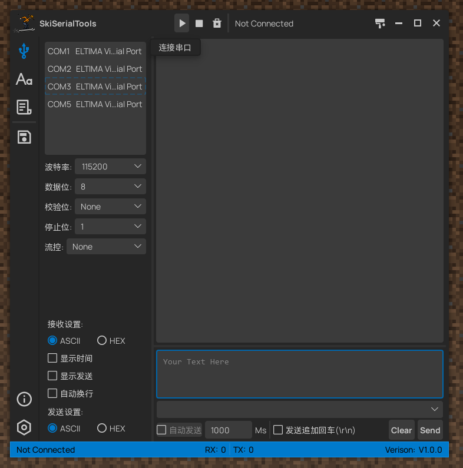
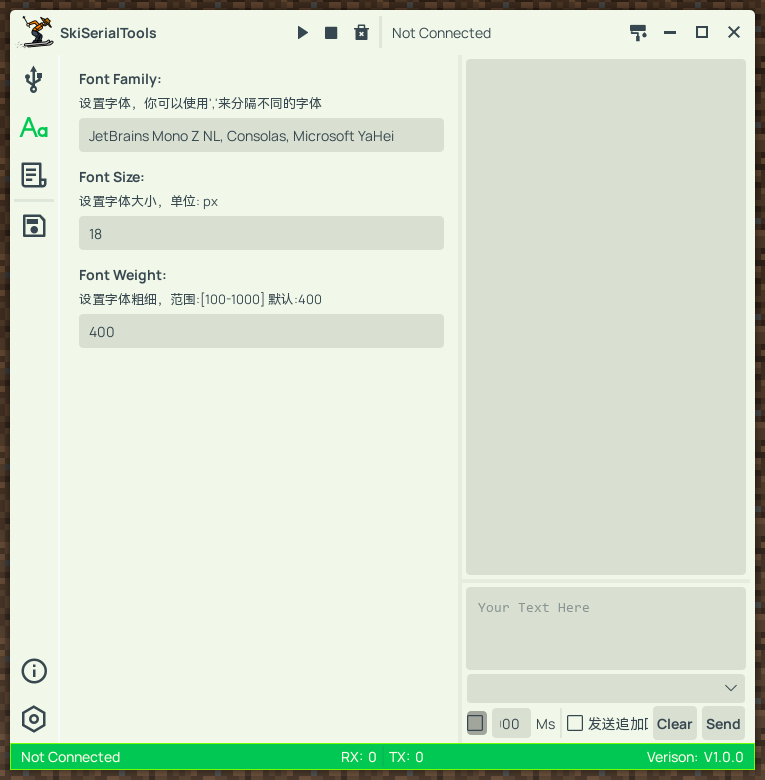
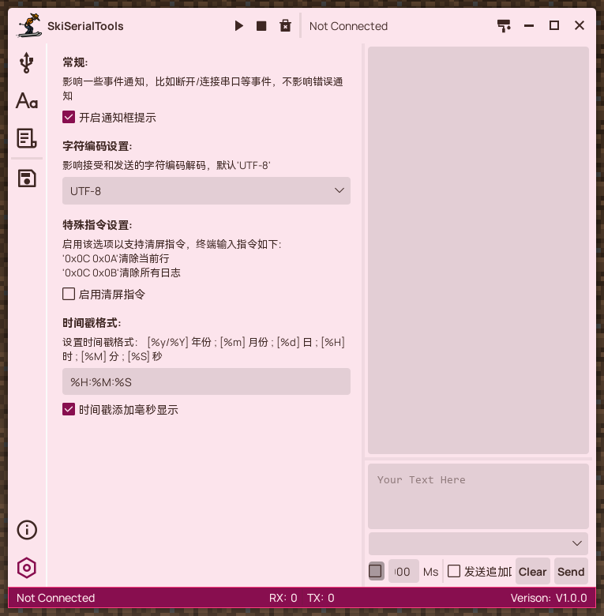
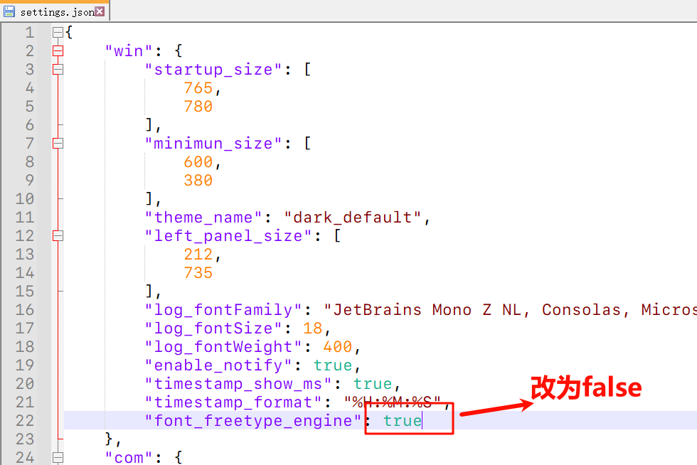

# 滑雪串口助手 & SkiSerialTools


@firestaradmin 2023/04/11

---

## 目录
- [更新日志](#更新记录)

---
## 简介

**A Simple&Good SerialPort tools.**

**一个简单易用的串口助手。**

### 特性：

- 方便直观的串口列表
- 友善的交UI交互
- 多主题配置，用户可自定义主题
- 串口日志显示，智能滚动
- 支持自定义十六进制指令
- 多字体设置、字符编码设置
- 等等









## 更新

### 更新记录

#### v1.1.1-beta
- fix: 内容过长导致的右侧窗体不能缩小
- perf: 优化发送历史记录逻辑
- fix: 修复侧边栏拖动大小宽度会变的问题
- fix: Hex显示时，最后一个字节为0x00 不显示问题，尚未测试
- fix: 修复XPlaintextedit hex 模式不能输入空格
- chore: 修复提示错误，更新ui库
- chore: 调整接收缓存设置大小
- perf: 优化参数


#### v1.1.0-beta
- fix: 修复程序启动未初始化日志字体设置
- theme: 添加几种了主题配色
- fix: 修复自动换行和时间戳显示不能完美共同工作问题
- ui: 更新图标
- feat: 高亮显示日志设置功能


#### v1.0.3-beta
- fix: 修复串口列表连接高亮显示在列表更新后就消失的问题
- feat: 日志文本颜色自定义功能
- perf: 优化自动换行逻辑
- fix: 修复中文UTF8解码有概率丢失数据问题

#### v1.0.2-beta
- 完善信息页面

#### v1.0.0-beta
- 重构后的新版本


### TODO

- feat: 日志自动记录功能
- feat: 主题可视化配置功能
- feat: 串口特殊指令自定义指令功能
- feat: 终端控制台模式
- feat: 程序运行日志、及日志等级配置功能


## 关于

**如果有任何宝贵的意见/建议 欢迎提交Issue**

联系方式：791836949@qq.com

❤❤❤❤❤❤❤❤❤❤❤❤❤❤❤❤❤❤❤❤❤❤❤❤❤❤❤❤❤❤❤❤❤

本软件永久免费，为爱发电。

如果本软件对您有些许帮助，可以考虑请作者喝杯小 Coffee☕☕☕ Mua~

❤❤❤❤❤❤❤❤❤❤❤❤❤❤❤❤❤❤❤❤❤❤❤❤❤❤❤❤❤❤❤❤❤

❤❤❤❤❤❤❤❤❤❤❤❤❤❤❤❤❤❤❤❤❤❤❤❤❤❤❤❤❤❤❤❤❤


❤❤❤❤❤❤❤❤❤❤❤❤❤❤❤❤❤❤❤❤❤❤❤❤❤❤❤❤❤❤❤❤❤❤❤❤❤❤❤❤❤❤❤❤❤❤❤❤❤❤❤❤❤❤❤❤❤❤❤❤❤❤❤❤❤❤❤❤❤❤❤❤❤❤❤❤❤❤❤❤❤❤❤❤❤❤❤❤❤❤❤❤❤❤❤❤❤❤❤❤❤❤❤❤❤❤❤❤❤❤❤❤❤❤❤❤❤❤❤❤❤❤❤❤❤❤❤❤❤❤❤❤❤❤❤❤❤❤❤❤❤❤❤❤❤❤❤❤❤❤❤❤❤❤❤❤❤❤❤❤❤❤❤❤❤❤❤❤❤❤❤❤❤❤❤❤❤❤❤❤

## Q&A

### 1、图标显示问题

软件使用freetype字体引擎，如果遇到图标显示不正常，比如显示方框的情况，只需要修改根目录下的配置文件 `./conf/settings.json`中freetype引擎改为false即可。

```json
"font_freetype_engine": false
```



---